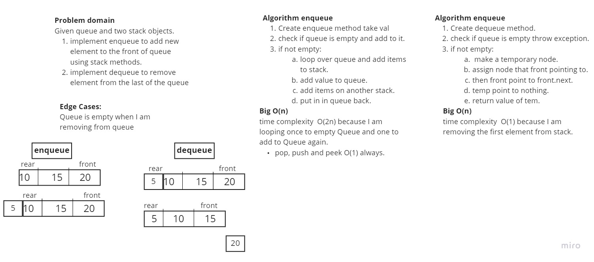
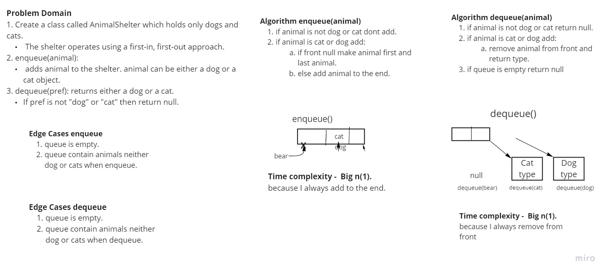

# Table of Contents
|Code Challenge| Code Challenge|White Board|
|--------------|-----------|-----------|
| Reverse Array| [code challenge](challenges/ArrayReverse.java)|[White Board](assets/array-reverse.jpeg)|
| Reverse Shift| [code challenge](challenges/ArrayShift.java)|[White Board](assets/array-shift.png)|
| Binary Search| [code challenge](challenges/BinarySearch.java)|[White Board](assets/array.png)|
| Linked List| [code challenge](challenges/DataStructures/linkedList/LinkedList.java)|[No white board]()|
| 6 Linked List 2| [code challenge](challenges/DataStructures/linkedList/LinkedList.java)|[Append, insertBefore, InsertAfter](assets/class%206.jpg)|
| Class 07 ll-kth-from-end| [code challenge](challenges/DataStructures/linkedList/LinkedList.java)|[kthFromEnd White board](assets/kthFromEnd.jpg)|
| Class 08 Zip Linked List| [code challenge](challenges/DataStructures/linkedList/LinkedList.java)|[Zip white board](assets/zip%20white%20board.jpg)|
| Stack | [code challenge](challenges/stacksandqueues/Stack.java)|[Stack white board](assets/stack.jpg)|
| Queue | [code challenge](challenges/stacksandqueues/Queue.java)|[Queue white board](assets/queue.jpg)|
| PseudoQueue | [code challenge](challenges/stacksandqueues/PseudoQueue.java)|[PseudoQueue white board](assets/PseudoQueue.jpg)|
| animal shilter :important(scroll down for explination on challenge) | [code challenge](challenges/utilities/AnimalShelter.java)|[White board Animal Shilter](assets/animalShilter.jpg)|

## Compile my files:
 * code direclty inside the **challenge folder** can compile it like this from terminal :
   1. `$ javac ReverseArray.java ` to compile file.
   2. `$ java ReverseArray.java ` to run Class file.

 * Code live inside another directory will have to do following:
   1. `$ javac linkedList/LinkedList.java ` to compile file inside linkedList directory.
   2. `$ java linkedList/LinkedList ` to run byte code generated.

## Reverse an Array
Given Array of N number of elements, return the index of elements in reverse.
for example: `{1,2,3,4,5}` should return `{5,4,3,2,1}`.

### Challenge
write a method `reverseArray` that take an array as parameter and return order array in reverse.

### Approach & Efficiency
Big O:
Time Complexity:  O(n)

### Solution

## Shift an Array
Given array of N elements and a new element, return a new array that contain the new element exactly in the middle.

### Challenge
write a method `insertShiftArray` that take an array and element, return a new array contain new element index exactly in the middle.

### Approach & Efficiency
Big O:
Time Complexity:  O(n)

### Solution

## Binary Search 

## Linked List Basic implementation
Create a new list using linked list, add, insert, check if item in list and retrieve all items in list.

### Approach & Efficiency
Big O:
`Insert()` Time Complexity:  O(n)
`include()` Time Complexity:  O(n)
`add()` Time Complexity:  O(n)
`toString()` Time Complexity:  O(n)

### Solution
No white board for this code.

# insertBefore, insertAfterm append
<!-- Short summary or background information -->
 * Insert before 
 * insert after
 * append to linked list.
## Challenge Description
<!-- Description of the challenge -->
 * Insert before a value in linkedList.
 * insert after a value in linked list.
 * append to linked list

## Approach & Efficiency
  Big O :
  time complexity ----> O(n)

## Solution
No white board for this soultion

# Class 7 `kthFromEnd(k)`
* Write a method for the Linked List class which takes a number, k, as a parameter.
* Return the node’s value that is k from the end of the linked list.

## Challenge Description
* Write a method for the Linked List class which takes a number, k, as a parameter.
* Return the node’s value that is k from the end of the linked list.

## Approach & Efficiency
 Big O :
  Time complexity ----> O(n+n)

## Solution7
<!-- Embedded whiteboard image -->
No white board for this soultion

# zip(Linkedlist one, Linkedlist two)
<!-- Short summary or background information -->
zip two arrays to one array.

## Challenge Description
 * given two Linked Lists, zip them to 1 LinkedList.
   * First import both one and two should be inserted.
   * next rount the next to head item will be zipped and so on.
   * if 1 is shorter than the other, it should stop appending from short and continue adding the second List.

## Approach & Efficiency
 Big O :
  Time complexity ----> O(n)  since I am adding from both same current node.
## Solution
 

# Stacks and Queues

## Challenge
<!-- Description of the challenge -->
* stack : I will perform push,pop,peek,isEmpty
* queue: I will perform enqueue,dequeue,peek,isEmpty

## Approach & Efficiency
* Stack Time complexity Big O():
    * `push()`   **Big O(1)**
    * `pop()` **Big O(1)**
    * `peek()` **Big O(1)**
    * `isEmpty()` **Big O(1)**
* Queue Time complexity Big O():
    * `enqueue()` **Big O(1)**
    * `dequeue()` **Big O(1)**
    * `peek()` **Big O(1)**
    * `isEmpty()` **Big O(1)**

## API
* `class Stack` :
    * `push()`
    * `pop()` 
    * `peek()` 
    * `isEmpty()` 
* `Class Queue` :
    * `enqueue()` 
    * `dequeue()` 
    * `peek()` 
    * `isEmpty()`

## Code Challenge: Class 11 PseudoQueue
Given queue and two stack objects.
implement enqueue to add new element to the front of queue using stack methods.
implement dequeue to remove element from the last of the queue

## Challenge Description
#### Algorithm enqueue

Create enqueue method take val
check if queue is empty and add to it.
if not empty:
loop over queue and add items to stack.
add value to queue.
add items on another stack.
put in in queue back.

#### Algorithm enqueue

Create dequeue method.
check if queue is empty throw exception.
if not empty:
 make a temporary node.
assign node that front pointing to.
then front point to front.next.
temp point to nothing.
return value of tem.

## Approach & Efficiency
* `PseudoQueue {}` class contain 4 methods:
  * `enqueue()` **Big O(2n)**
  * `dequeue()` **Big O(1)**
  * `isEmpty()` **Big O(1)**
  * `toString()` **Big O(n)**

## Solution

## Animal shilter Summary challenge 12
1. Create a class called AnimalShelter which holds only dogs and cats.
    The shelter operates using a first-in, first-out approach.
1. **enqueue(animal)**:
 adds animal to the shelter. animal should be either a dog or a cat object.

2. **dequeue(pref)**: returns either a dog or a cat. 
If pref is not "dog" or "cat" then return null.
## Challenge Description
* I am using polymorphisim in this challenge:
    1. (challenges/utilities) a folder contain following classes:
       1. `Animal{}`
          constructor for `name` attribute.
       2. `Cat{}` constructor inherit constructor from animal class
       3. `Dog{}`c onstructor inherit constructor from animal class
       4. `Node{}`  contain animal object.
       5. `AnimalShilter{}` queue contain front, rear dog instance as well as cat instance

#### testing : 
  [testing this challenge](test/utilities/AnimalShelterTest.java)
## Approach & Efficiency
* **enqueue Big O(1)**: because i am adding to the end always.
* **enqueue Big O(1)** : because i am removing from front always.
## Solution

