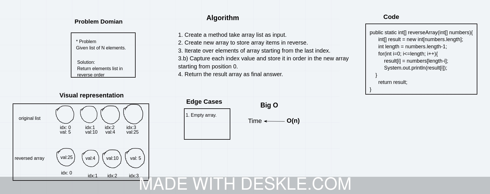
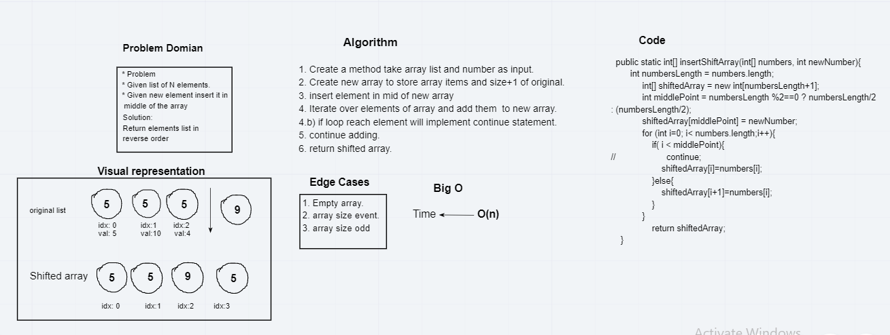

# Table of Contents
|Code Challenge| Code Challenge|White Board|
|--------------|-----------|-----------|
| Reverse Array| [code challenge](challenges/ArrayReverse.java)|[White Board](assets/array-reverse.jpeg)|
| Reverse Shift| [code challenge](challenges/ArrayShift.java)|[White Board](assets/array-shift.png)|
| Binary Search| [code challenge](challenges/BinarySearch.java]|[White Board](assets/array.png)|
| Linked List| [code challenge](challenges/linkedList/LinkedList.java]|[White Board](assets/array.png)|

## Compile my files:
 * code direclty inside the **challenge folder** can compile it like this from terminal :
   1. `$ javac ReverseArray.java ` to compile file.
   2. `$ java ReverseArray.java ` to run Class file.

 * Code live inside another directory will have to do following:
   1. `$ javac linkedList/LinkedList.java ` to compile file inside linkedList directory.
   2. `$ java linkedList/LinkedList ` to run byte code generated.

## Reverse an Array
Given Array of N number of elements, return the index of elements in reverse.
for example: `{1,2,3,4,5}` should return `{5,4,3,2,1}`.

### Challenge
write a method `reverseArray` that take an array as parameter and return order array in reverse.

### Approach & Efficiency
Big O:
Time Complexity:  O(n)

### Solution

## Shift an Array
Given array of N elements and a new element, return a new array that contain the new element exactly in the middle.

### Challenge
write a method `insertShiftArray` that take an array and element, return a new array contain new element index exactly in the middle.

### Approach & Efficiency
Big O:
Time Complexity:  O(n)

### Solution

## Binary Search 

## Linked List Basic implementation
Create a new list using linked list, add, insert, check if item in list and retrieve all items in list.

### Approach & Efficiency
Big O:
`Insert()` Time Complexity:  O(n)
`include()` Time Complexity:  O(n)
`add()` Time Complexity:  O(n)
`toString()` Time Complexity:  O(n)

### Solution
No white board for this code.
