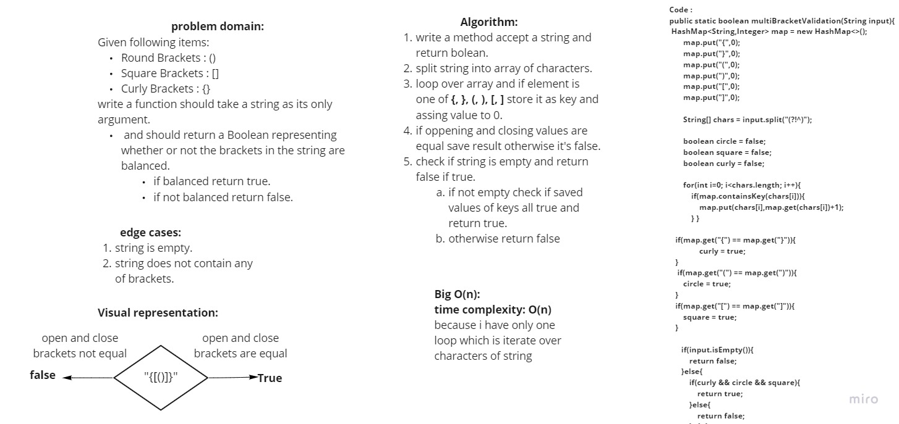
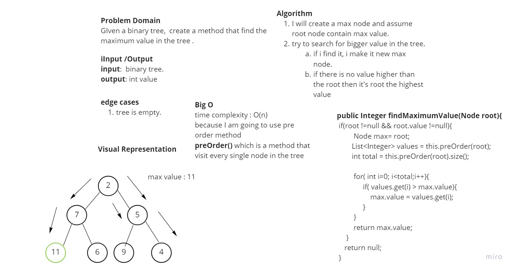

# Table of Contents
**From Now on, I will be adding the class test location in each new challenge paragraph**
|Code Challenge| Code Challenge|White Board|
|--------------|-----------|-----------|
| Reverse Array| [code challenge](challenges/ArrayReverse.java)|[White Board](assets/array-reverse.jpeg)|
| Reverse Shift| [code challenge](challenges/ArrayShift.java)|[White Board](assets/array-shift.png)|
| Binary Search| [code challenge](challenges/BinarySearch.java)|[White Board](assets/array.png)|
| Linked List| [code challenge](challenges/DataStructures/linkedList/LinkedList.java)|[No white board]()|
| 6 Linked List 2| [code challenge](challenges/DataStructures/linkedList/LinkedList.java)|[Append, insertBefore, InsertAfter](assets/class%206.jpg)|
| Class 07 ll-kth-from-end| [code challenge](challenges/DataStructures/linkedList/LinkedList.java)|[kthFromEnd White board](assets/kthFromEnd.jpg)|
| Class 08 Zip Linked List| [code challenge](challenges/DataStructures/linkedList/LinkedList.java)|[Zip white board](assets/zip%20white%20board.jpg)|
| Stack | [code challenge](challenges/stacksandqueues/Stack.java)|[Stack white board](assets/stack.jpg)|
| Queue | [code challenge](challenges/stacksandqueues/Queue.java)|[Queue white board](assets/queue.jpg)|
| PseudoQueue | [code challenge](challenges/stacksandqueues/PseudoQueue.java)|[PseudoQueue white board](assets/PseudoQueue.jpg)|
| animal shilter :important(scroll down for explination on challenge) | [code challenge](challenges/utilities/AnimalShelter.java)|[White board Animal Shilter](assets/animalShilter.jpg)|
| multiBracketValidation | [code challenge](challenges/utilities/MultiBracketValidation.java)|[White board multi Bracket Validation](assets/multiBracketValidation.jpg)|
| class 15 Tree |1. [tree code ](challenges/tree/Tree.java) 2.[binary tree](challenges/tree/BinaryTree.java) 3. [binary search tree](challenges/tree/BinarySearchTree.java)|1. [binary tree whiteboard](assets/InkedBinary%20Tree_LI.jpg) 2. [binary search tree whiteboard](assets//BinarySearchTree.jpg)|
| class 16 | [code challenge](challenges/tree/BinaryTree.java)|[Maximum value in binary tree white board](assets/maximumValue.jpg)|
| class 30 | [code challenge](/challenges/hashtable/Hashtable.java)|No White board for this challenge|
| class 32 | [code challenge](/challenges/tree/TreeInterSection.java)|No White board for this challenge [Tests](/challenges/tree/TreeInterSectionTest.java)|
| class 31 | [Repeated word](/challenges/RepeatedWord/RepeatedWord.java)|[repeated words whiteboard](assets/repeated%20word.jpg)|
| class 33 | [Left Join](/challenges/LeftJoin/LeftJoin.java)|[left join white board](assets/repeated%20word.jpg)|

| class 35 | [Graph Code](/challenges/graph/Graph.java)|Documentation at the end of this Readme|

| class 36 | [breadth first search of graph](/challenges/BreadthFirst/BreadthFirstTest.java)|[ whiteboard](assets/Breadth-First%20Traversal%20of%20a%20Graph.jpg)|

## Compile my files:
 * code direclty inside the **challenge folder** can compile it like this from terminal :
   1. `$ javac ReverseArray.java ` 
   2. to compile file.
   3. `$ java ReverseArray.java ` to run Class file.

 * Code live inside another directory will have to do following:
   1. `$ javac linkedList/LinkedList.java ` to compile file inside linkedList directory.
   2. `$ java linkedList/LinkedList ` to run byte code generated.

## Reverse an Array
Given Array of N number of elements, return the index of elements in reverse.
for example: `{1,2,3,4,5}` should return `{5,4,3,2,1}`.

### Challenge
write a method `reverseArray` that take an array as parameter and return order array in reverse.

### Approach & Efficiency
Big O:
Time Complexity:  O(n)

### Solution

## Shift an Array
Given array of N elements and a new element, return a new array that contain the new element exactly in the middle.

### Challenge
write a method `insertShiftArray` that take an array and element, return a new array contain new element index exactly in the middle.

### Approach & Efficiency
Big O:
Time Complexity:  O(n)

### Solution

## Binary Search 

## Linked List Basic implementation
Create a new list using linked list, add, insert, check if item in list and retrieve all items in list.

### Approach & Efficiency
Big O:
`Insert()` Time Complexity:  O(n)
`include()` Time Complexity:  O(n)
`add()` Time Complexity:  O(n)
`toString()` Time Complexity:  O(n)

### Solution
No white board for this code.

# insertBefore, insertAfterm append
<!-- Short summary or background information -->
 * Insert before 
 * insert after
 * append to linked list.
## Challenge Description
<!-- Description of the challenge -->
 * Insert before a value in linkedList.
 * insert after a value in linked list.
 * append to linked list

## Approach & Efficiency
  Big O :
  time complexity ----> O(n)

## Solution
No white board for this soultion

# Class 7 `kthFromEnd(k)`
* Write a method for the Linked List class which takes a number, k, as a parameter.
* Return the node’s value that is k from the end of the linked list.

## Challenge Description
* Write a method for the Linked List class which takes a number, k, as a parameter.
* Return the node’s value that is k from the end of the linked list.

## Approach & Efficiency
 Big O :
  Time complexity ----> O(n+n)

## Solution7
<!-- Embedded whiteboard image -->
No white board for this soultion

# zip(Linkedlist one, Linkedlist two)
<!-- Short summary or background information -->
zip two arrays to one array.

## Challenge Description
 * given two Linked Lists, zip them to 1 LinkedList.
   * First import both one and two should be inserted.
   * next rount the next to head item will be zipped and so on.
   * if 1 is shorter than the other, it should stop appending from short and continue adding the second List.

## Approach & Efficiency
 Big O :
  Time complexity ----> O(n)  since I am adding from both same current node.
## Solution
 

# Stacks and Queues

## Challenge
<!-- Description of the challenge -->
* stack : I will perform push,pop,peek,isEmpty
* queue: I will perform enqueue,dequeue,peek,isEmpty

## Approach & Efficiency
* Stack Time complexity Big O():
    * `push()`   **Big O(1)**
    * `pop()` **Big O(1)**
    * `peek()` **Big O(1)**
    * `isEmpty()` **Big O(1)**
* Queue Time complexity Big O():
    * `enqueue()` **Big O(1)**
    * `dequeue()` **Big O(1)**
    * `peek()` **Big O(1)**
    * `isEmpty()` **Big O(1)**

## API
* `class Stack` :
    * `push()`
    * `pop()` 
    * `peek()` 
    * `isEmpty()` 
* `Class Queue` :
    * `enqueue()` 
    * `dequeue()` 
    * `peek()` 
    * `isEmpty()`

## Code Challenge: Class 11 PseudoQueue
Given queue and two stack objects.
implement enqueue to add new element to the front of queue using stack methods.
implement dequeue to remove element from the last of the queue

## Challenge Description
#### Algorithm enqueue

Create enqueue method take val
check if queue is empty and add to it.
if not empty:
loop over queue and add items to stack.
add value to queue.
add items on another stack.
put in in queue back.

#### Algorithm enqueue

Create dequeue method.
check if queue is empty throw exception.
if not empty:
 make a temporary node.
assign node that front pointing to.
then front point to front.next.
temp point to nothing.
return value of tem.

## Approach & Efficiency
* `PseudoQueue {}` class contain 4 methods:
  * `enqueue()` **Big O(2n)**
  * `dequeue()` **Big O(1)**
  * `isEmpty()` **Big O(1)**
  * `toString()` **Big O(n)**

## Solution

## Animal shilter Summary challenge 12
1. Create a class called AnimalShelter which holds only dogs and cats.
    The shelter operates using a first-in, first-out approach.
1. **enqueue(animal)**:
 adds animal to the shelter. animal should be either a dog or a cat object.

2. **dequeue(pref)**: returns either a dog or a cat. 
If pref is not "dog" or "cat" then return null.
## Challenge Description
* I am using polymorphisim in this challenge:
    1. (challenges/utilities) a folder contain following classes:
       1. `Animal{}`
          constructor for `name` attribute.
       2. `Cat{}` constructor inherit constructor from animal class
       3. `Dog{}`c onstructor inherit constructor from animal class
       4. `Node{}`  contain animal object.
       5. `AnimalShilter{}` queue contain front, rear dog instance as well as cat instance

#### testing : 
  [testing this challenge](test/utilities/AnimalShelterTest.java)
## Approach & Efficiency
* **enqueue Big O(1)**: because i am adding to the end always.
* **enqueue Big O(1)** : because i am removing from front always.
## Solution

# multiBracketValidation code challenge 13
Your function should take a string as its only argument, and should return a boolean representing whether or not the brackets in the string are balanced. There are 3 types of brackets:

* Round Brackets : ()
* Square Brackets : []
* Curly Brackets : {}

## Challenge Description
* Method : `multiBracketValidation(String value)`
* test class : `multiBracketValidationTest()`  [test class code](test/utilities/MultiBracketValidationTest.java)
 write a solution that return true when brackets openning and closing are equal otherwise false.
method edge case is the string is empty

## Approach & Efficiency
Big O(n) 
time complexity : Big O(n) because I will loop over characters to check each one if it's openning or closing bracket.
## Solution

# Trees

##### Binary Tree

* Define a method for each of the depth first traversals called `preOrder()`, `inOrder()`, and `postOrder()` which returns an array of the values, ordered appropriately.

##### Binary Search Tree
* Define a method named `add()` that accepts a value, and adds a new node with that value in the correct location in the binary search tree.
* Define a method named `contains()` that accepts a value, and returns a boolean indicating whether or not the value is in the tree at least once.
## Challenge
 * `public Node{}`
   * Node contain `Integer value, Node left, Node right`.
 * `BinaryTree{}`
   * constructor `BinaryTree(){}`
   * constructor `BinaryTree(value){}`
   * contain 3 methods: 
     * `preOrder()`
     * `inOrder()`
     * `postOrder()`
   * `BinarySearchTree{}`
     * `root node`.
     * constructor `BinarySearchTree(){}`
     * constructor `BinarySearchTree(value){}`
     * add
## Approach & Efficiency
<!-- What approach did you take? Why? What is the Big O space/time for this approach? -->
* `preOrder()` : time complexity Big O(n) : because I visited every node in order to print each value
* `inOrder()`  : time complexity Big O(n) : because I visited every node in order to print each value
* `postOrder()`: time complexity Big O(n) : because I visited every node in order to print each value

 * `add()` : time complexity Big O(h) : because I am adding node either to left or right of the root node.
 * `contain()` : time complexity Big O(h) : because I am searching for a specific node in tree.
## API
<!-- Description of each method publicly available in each of your trees -->
 1. to create a tree use:
    `Tree ()` constructor.
    `Tree (val)` constructor.

2. to preform `add() and contain`
     * init a a **binary search object** from `BinarySearchTree()` constructor.
       * `obj.add(val,tree.root)`: to add new node to my tree.
       * `obj.contain(val,tree.root)` to check if a value exist in tree or not.

3. Print in preOrder, inOrder, post Order.
   * init an object from BinarySearch class.
     * `obj.preOrder();`
     * `obj.inOrder();`
     * `obj.postOrder();`
   * then call List node : `obj.node`;
   * loop over values and print them or perform any action you like.

# maximum value in tree
GIven a binary tree,  create a method that find the maximum value in the tree.

## Challenge Description
I will create a max node and assume root node contain max value.
try to search for bigger value in the tree.
if i find it, i make it new max node.
if there is no value higher than the root then it's root the highest value

## Approach & Efficiency
Big O

time complexity : O(n)

because I am going to use pre order method which is a method that visit every single node in the tree.

## Solution

# Hashtables
  - hash table used to store items in array wof size n.
  - the point is to use advantage of array indexing access time complexity which is O(1)
  - data will be stored in key pair value.
  - and then i will hash the key to generate integer value that will be index in the array.
  - a great example of this is library.
 
 ## Challenge
- create following methods:
  - add: takes in both the key and value. This method should hash the key, and add the key and value pair to the table, handling collisions as needed.
  - get: takes in the key and returns the value from the table.
  - contains: takes in the key and returns a boolean, indicating if the key exists in the table already.
  - hash: takes in an arbitrary key and returns an index in the collection.

## Approach & Efficiency
<!-- What approach did you take? Why? What is the Big O space/time for this approach? -->
 - hash table is always O(1)
 - add(key,value) : O(1) because i add to head always.
 - get(key): is O(n) because i will search for value in linked list and it might be the last item.
 - contains(key): is O(n) because i will check for value in linked list and it might be the last item.

## API
<!-- Description of each method publicly available in each of your hashtable -->
 - add(key,value) 
 - get(key)
 - contains(key)

# Repeated words in string
<!-- Description of the challenge -->
given a string, give the first repeated word in that string.

## Whiteboard Process

## Approach & Efficiency

* **Big O**
  - time complexity : O(n*m) because the word might that will be repeated might be in the last 2 indexes.
  - space complexity: O(n): because i reserve array size for n words.
## Solution
   - `ClassName.findRepeated(String);`
   - then print result back from method which is one word.

# Challenge Summary
 given two binary trees.
 find common values in both trees

## Approach & Efficiency
<!-- What approach did you take? Why? What is the Big O space/time for this approach? -->
- time complexity : Big O(3n) because i added items of tree one in list one, tree two in list two and result to another list....
- space complexity : Big O(3n) because i have three new lists.
## Solution
- first i take two trees as input.
- traverse them accordingly.
- add each value to arrayList.
- and run check if value of list one exist in list two.
- then add it to result list.
- return list.

# Hashmap LEFT JOIN
Implement a simplified LEFT JOIN for 2 Hashmaps

## Challenge
a function accept two hash maps and join them to a single data structure.

## Approach & Efficiency
Big O:

- time: O(n): because i only iterate over the left map and based on it i get the right map which is n.

- space: O(n*3) because each time i reserve 3 index to join and 3 is fixed and n is total number of items in maps.

## Solution

# Graphs
<!-- Short summary or background information -->
implement graphs using java language

## Challenge
<!-- Description of the challenge -->
 add nodes to graph.
 add edges between nodes.
 add weight.
 view all nodes.
 view neighbors

## Approach & Efficiency
Big O for all methods:-
   - AddNode : 
     - time:   O(n) since i am adding to the end of the list.
     - space:  O(1) because i needed extra space only for current edge node
   - AddEdge : 
     - time:   O(n) also because i am adding to the end of the list.
     - space: O(1) because i needed extra space only for current edge node
   - GetNodes : 
     - time:   O(n) because i am visiting all nodes in the list.
     - space:  O(n) because i return array of items.
   - GetNeighbors : 
     - time:   O(n) because checking all nodes if they are neighbors
     - space:  O(n) because returning list.
   - Size : 
     - time: O(n) because i am visiting all nodes in the list to count.
     - space: O(1) because only 1 integer value extra required.

## API
<!-- Description of each method publicly available in your Graph -->
 1. **AddNode()**  takes Integer value
 2. **AddEdge()**   take two values from graph.
 3. **GetNodes()**  method called on graph
 4. **GetNeighbors()**  called on endge from graph
 5. **Size()**  method invoked on graph.

# Breadth-First Traversal of a Graph
<!-- Description of the challenge -->
traverse over graph using Breadth First Traversal of a Graph.

## Whiteboard Process
 

## Approach & Efficiency
Big O:

time: O(n) because i must visit all vertices in graph.

space: O(n) - space required in returned list.
