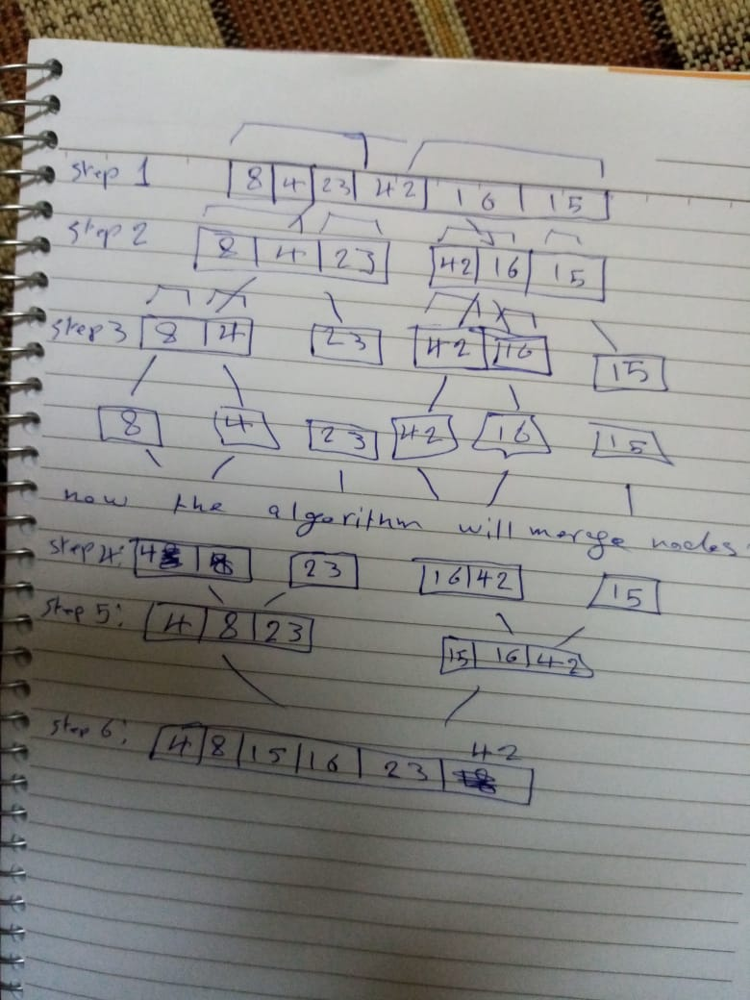

## Merge Sort
- merge sort is sorting algorithim uses divide and conquer
- merge sort iterate on array recursively.
- so the basic idea of the algorithim, it take n array.
  -  then divide it into half.
  - then recursively call method into newly divided two smaller arrays.
  - until i have each node stand alone.
  - then start merging the nodes in array.
  - during merge it check if left array item and right array item to place each item in it's proper position


###### Data
[8,4,23,42,16,15]

#### Pesudo
- `mergesort(arr)`:
    - take array. 
    - split array into smaller arrays (left and right)
    - call merge sort function recursively on left array and right array.
    - and call merge function and send result of.
- `merge(left, right, arr)` function:
  - take left and right arrays and original array.
  - compare values of left and right arrays.
  - and place them in their position in the original array.

```java
ALGORITHM Mergesort(arr)
    DECLARE n <-- arr.length
           
    if n > 1
      DECLARE mid <-- n/2
      DECLARE left <-- arr[0...mid]
      DECLARE right <-- arr[mid...n]
      // sort the left side
      Mergesort(left)
      // sort the right side
      Mergesort(right)
      // merge the sorted left and right sides together
      Merge(left, right, arr)

ALGORITHM Merge(left, right, arr)
    DECLARE i <-- 0
    DECLARE j <-- 0
    DECLARE k <-- 0

    while i < left.length && j < right.length
        if left[i] <= right[j]
            arr[k] <-- left[i]
            i <-- i + 1
        else
            arr[k] <-- right[j]
            j <-- j + 1
            
        k <-- k + 1

    if i = left.length
       set remaining entries in arr to remaining values in right
    else
       set remaining entries in arr to remaining values in left

```
##### implementation


##### test:
  
##### Analysis
- **Time** Complexity **Big O(n*log n)**, because first i algorthim is divided by half each time which is gonna take **log n** time to do this, and  as for **merging** it require **n time** so it's **n log n** for **all possbile Cases**
- space complexity: Big O(n) because it's not requiring extra space to implement it.