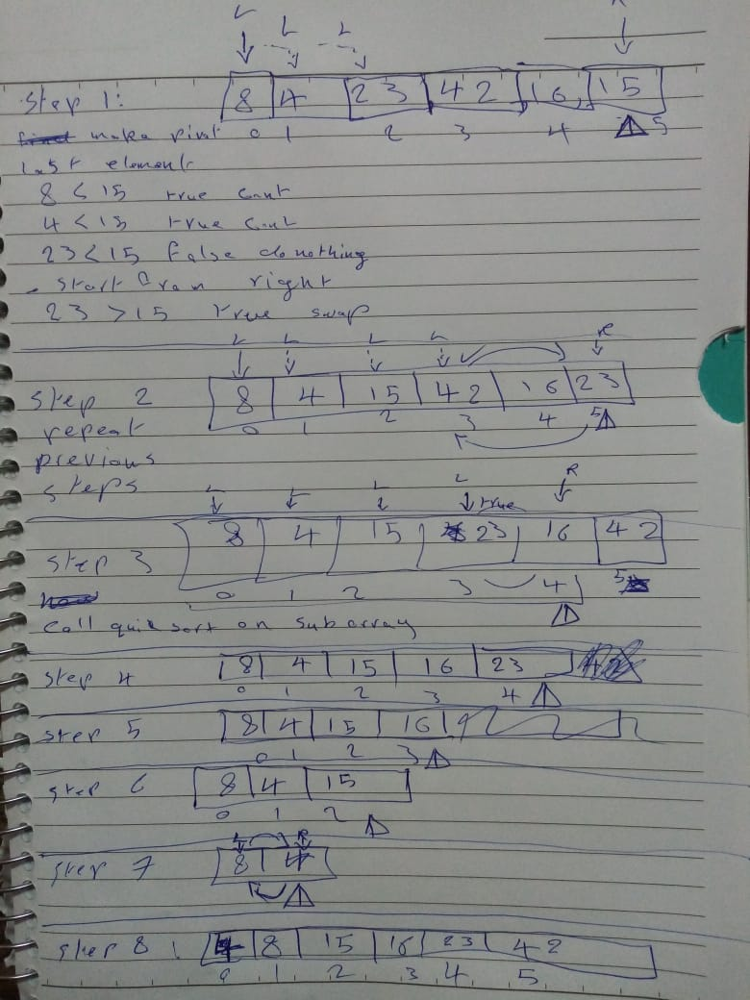

# Quick Sort 
- Sort array of items by choosing random item in the array and make it a pivot.
- the pivot will porition the array into half.
- then it will search for item from left that is greater than pivot and when it find it it stop.
- then it will search for item from right that is greater than pivot and when it find it, will stop
- then call swap method and swap greater item position with smaller item position.
- and then part of pivot on the left will call qucksort method again.
- also part on the right until all items on left of pivot and on right of pivot are in their correct position.

### Algorithim Trace

### Tests

ALgo Analysis
- Time complexity Big O(n log n)
  - because each time array get's divided it's n*log n
- Space Complexity Big O(1) because i wont alocate extra space for algorithim.